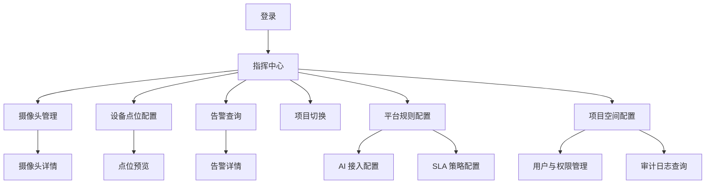
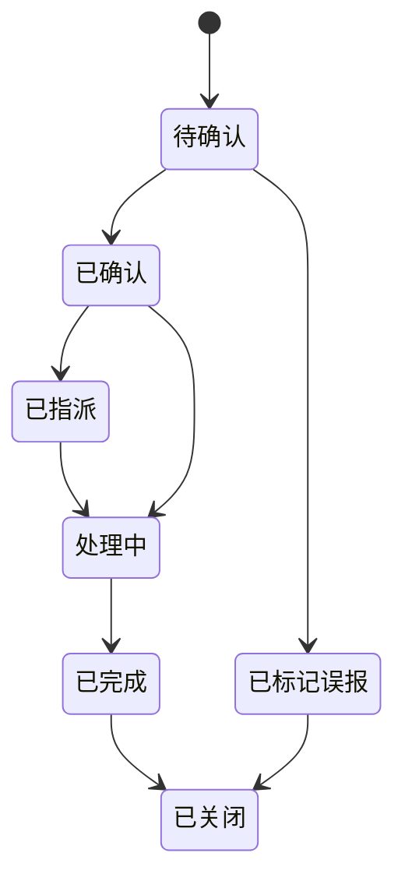
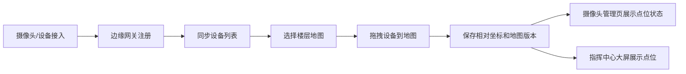
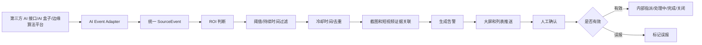
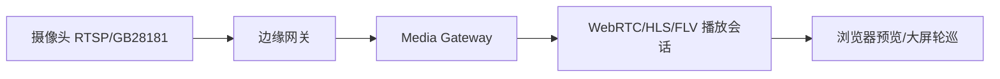

# 商业地产 AI 视频巡检 SaaS PRD

版本：V1.0  
场景：购物中心、商业综合体、写字楼商业裙楼日常物业巡检  
交付物：研发可执行 PRD + HTML 可点击原型

## 1. 产品概述

### 1.1 产品定位

本产品面向商业地产物业管理团队，提供“摄像头接入、第三方 AI 分析结果接入、平台规则过滤、人工确认闭环、设备点位地图配置、指挥中心可视化”的视频巡检 SaaS 系统。

第一版支持多项目切换和项目级数据上下文，但不做集团驾驶舱；底层按多租户 SaaS 设计，避免后续扩展到集团多项目总览时重构。

### 1.2 目标客户

- 购物中心物业公司
- 商业综合体运营管理方
- 商场中控室与安防团队
- 工程物业与现场巡检团队
- 管理层安全运营看板使用者

### 1.3 核心价值

- 接入第三方 AI 接口、AI 盒子或边缘算法平台的分析结果，由平台统一过滤、去重并生成告警。
- 用人工确认机制控制误报影响，形成可追溯的告警闭环。
- 用 2D/2.5D 楼层地图展示摄像头与设备空间位置。
- 用拖拽式点位配置降低实施与后期运维成本。
- 用告警数据沉淀巡检证据、SLA、风险趋势和管理报表。

### 1.4 MVP 范围

MVP 必须包含：

- 登录、租户、用户、角色与项目级权限
- 多项目切换与当前项目上下文
- 摄像头管理与状态展示
- 设备点位地图配置
- 2D/2.5D 指挥中心大屏
- 告警查询、详情、证据、内部指派与处置记录
- 第三方 AI 结果接入 + 平台规则过滤与告警生成链路
- 边缘网关与媒体服务的架构约束
- 操作审计与租户隔离

MVP 不包含：

- 真 3D 数字孪生建模
- 长周期完整录像回放管理
- 完整工单系统、工单编号、流转审批和第三方工单系统对接
- 移动端 App
- 集团多项目驾驶舱
- 自研/部署视觉 AI 推理模型服务
- 模型训练平台
- 全量厂商协议认证

## 2. 用户与权限

### 2.1 用户角色

| 角色 | 主要目标 | 典型操作 |
| --- | --- | --- |
| 系统管理员 | 维护租户、项目、账号和全局配置 | 用户管理、权限配置、审计查看 |
| 项目管理员 | 完成项目实施与日常配置 | 摄像头配置、楼层地图、设备点位、平台告警规则 |
| 中控值班员 | 实时发现并确认风险 | 查看大屏、处理告警、打开视频 |
| 安保主管 | 跟踪巡检质量和处置效率 | 查询告警、查看趋势、复盘 SLA |
| 工程/物业人员 | 处理现场问题 | 查看指派事件、上传处理说明和现场图片 |
| 管理层 | 掌握安全态势 | 查看大屏、报表、风险排行 |

### 2.2 权限矩阵

| 功能 | 系统管理员 | 项目管理员 | 中控值班员 | 安保主管 | 工程/物业 | 管理层 |
| --- | --- | --- | --- | --- | --- | --- |
| 登录系统 | 是 | 是 | 是 | 是 | 是 | 是 |
| 查看大屏 | 是 | 是 | 是 | 是 | 否 | 是 |
| 查看摄像头 | 是 | 是 | 是 | 是 | 部分 | 只读 |
| 修改摄像头配置 | 是 | 是 | 否 | 否 | 否 | 否 |
| 配置项目空间 | 是 | 是 | 否 | 否 | 否 | 否 |
| 配置设备资产/边缘网关 | 是 | 是 | 否 | 否 | 否 | 否 |
| 配置地图点位 | 是 | 是 | 否 | 否 | 否 | 否 |
| 修改平台告警规则 | 是 | 是 | 否 | 否 | 否 | 否 |
| 配置第三方 AI 接入 | 是 | 是 | 否 | 否 | 否 | 否 |
| 处理告警 | 是 | 是 | 是 | 是 | 部分 | 否 |
| 标记误报 | 是 | 是 | 是 | 是 | 否 | 否 |
| 上传处置附件 | 是 | 是 | 是 | 是 | 部分 | 否 |
| 查看证据 | 是 | 是 | 是 | 是 | 部分 | 只读 |
| 下载证据 | 是 | 是 | 是 | 是 | 部分 | 否 |
| 删除证据 | 是 | 是 | 否 | 否 | 否 | 否 |
| 导出报表 | 是 | 是 | 否 | 是 | 否 | 是 |
| 查看审计日志 | 是 | 部分 | 否 | 部分 | 否 | 否 |

权限控制原则：

- 所有业务对象必须包含 `tenantId`。
- 所有业务接口必须带 `projectId` 或从当前项目上下文解析 `projectId`。
- 数据访问必须同时校验 `tenantId + projectId + role`。
- 关键操作必须写入 `AuditLog`。
- 证据查看、下载、删除、导出需要单独权限。

### 2.3 多项目上下文

多项目切换是基础架构能力，不作为后期附加功能。

- 登录成功后返回用户可访问的 `projectIds`。
- 前端提供项目切换器，并把当前项目写入全局上下文 `currentProjectId`。
- 用户上次选择项目保存到 `UserPreference`。
- 大屏、摄像头、点位、告警、规则、报表均随项目切换刷新。
- 切换项目时必须关闭当前项目的视频播放会话、WebSocket/SSE 订阅，清空页面筛选条件和本地页面缓存，避免串流、串数和误操作。
- 后端每次请求校验 `tenantId + projectId + role`，禁止仅依赖前端上下文。

## 3. 信息架构

一级页面：

- 登录页
- 摄像头管理
- 设备点位配置
- 指挥中心大屏
- 告警查询
- 平台规则配置

配置类二级页面：

- 用户与权限管理：用户、角色、项目成员、数据权限范围。
- 项目空间配置：楼栋、楼层、区域、楼层图。
- 设备资产配置：设备、摄像头、边缘网关。
- 第三方 AI 接入配置：`AIEventAdapter`、密钥、字段映射和启停。
- SLA 策略配置：按告警类型和等级配置响应/完成时限。
- 审计日志查询：按用户、对象、动作、结果和时间检索。

推荐导航：



## 4. 页面需求

### 4.1 登录页

目标：让授权用户安全进入对应项目空间。

入口：系统访问域名或企业专属子域名。

核心功能：

- 账号密码登录
- 企业/项目识别
- 登录成功后获取可访问项目列表
- 默认进入用户上次选择项目，若无偏好则进入第一个授权项目
- 记住账号
- 忘记密码
- 登录失败次数限制
- 登录、登出、密码重置审计
- 后续兼容验证码、MFA、企业 SSO

字段：

- 企业编码或租户标识
- 用户名
- 密码
- 记住账号

状态：

- 默认
- 输入错误
- 登录失败
- 账号锁定
- 服务不可用
- 登录中

验收标准：

- 正确账号可进入指挥中心。
- 错误账号显示明确错误，不暴露账号是否存在。
- 连续失败达到阈值后限制登录。
- 登录成功与失败均写入审计。
- 登录后返回 `projectIds`，前端可完成项目切换。

### 4.2 摄像头管理页

目标：管理摄像头资产、状态、预览、AI 能力和点位关联。

入口：侧边导航“摄像头管理”。

核心功能：

- 摄像头列表
- 按项目、点位配置楼层/区域、状态、AI 能力筛选
- 缩略图展示
- 实时预览入口
- 点位定位入口
- AI 规则绑定状态
- 近期告警统计
- 摄像头详情抽屉

列表字段：

- 摄像头名称
- 所属楼层/区域：来源于 `DevicePoint + Floor + Zone` 配置结果；未配置点位时显示“未配置”
- 设备健康状态 `deviceHealthStatus`：在线、离线、故障
- 媒体流状态 `mediaStatus`：可预览、转码中、断流、鉴权失败
- 点位配置状态 `pointConfigStatus`：已配置、未配置
- 告警态 `alarmState`：正常、告警中
- 视频协议：RTSP、GB28181、厂商平台
- 所属边缘网关
- AI 能力
- 最近告警时间

交互：

- 点击摄像头行打开详情抽屉。
- 点击“定位”跳转至点位配置页并高亮设备。
- 点击“预览”打开播放浮层或右侧预览面板。
- 无权限用户仅可查看，不显示修改按钮。

技术约束：

- 前端不展示原始 `streamUrl`。
- 播放地址由 Media Gateway 生成短时鉴权播放会话。
- 缩略图由后端定时抽帧生成。
- `deviceHealthStatus` 由网关心跳、最近帧时间和设备探测结果综合计算。
- `mediaStatus` 由 Media Gateway 播放会话与转码探测结果计算。
- `pointConfigStatus` 由 `DevicePoint` 是否存在计算，不能与设备健康状态混用。
- `alarmState` 由当前未关闭告警或实时事件聚合计算。

验收标准：

- 可按状态和楼层筛选。
- 可查看每路摄像头的媒体状态和 AI 规则状态。
- 未配置点位的摄像头有明显提示。
- 摄像头列表中的楼层/区域必须由点位配置结果生成，不能直接读取摄像头资产静态字段。
- 无权限用户不能修改摄像头配置。

### 4.3 设备点位地图配置页

目标：让项目管理员通过拖拽方式将摄像头/设备资产绑定到当前楼层地图坐标，并同步到大屏与摄像头管理页；摄像头管理页的楼层/区域字段由该配置结果生成。

入口：侧边导航“点位配置”，或摄像头管理页点击“定位”。

布局：

- 左侧：全量摄像头/设备列表，按“未配置设备”和“已配置设备”分组展示，不按当前楼层过滤。
- 中间：楼层地图控件，支持缩放、平移、点位拖拽。
- 右侧：选中设备属性面板。
- 顶部：项目、楼栋、楼层切换、保存、撤销、重置、预览。

核心功能：

- 从全量未配置设备列表拖拽设备到当前楼层地图。
- 在地图内继续拖动点位。
- 删除点位后设备回到未配置列表。
- 支持点位旋转、显示/隐藏、层级设置。
- 保存当前楼层点位配置。
- 保存前校验楼层图版本。
- 预览大屏展示效果。

保存数据：

```json
{
  "tenantId": "tenant_001",
  "projectId": "mall_001",
  "floorId": "L1",
  "floorMapId": "map_L1",
  "floorMapVersion": 3,
  "points": [
    {
      "deviceId": "CAM-L1-001",
      "deviceType": "camera",
      "xRatio": 0.42,
      "yRatio": 0.36,
      "rotation": 90,
      "scale": 1,
      "zIndex": 10,
      "iconType": "dome-camera",
      "visibleOnBigScreen": true,
      "version": 7
    }
  ]
}
```

业务规则：

- 未配置设备才能从左侧拖入地图。
- 已配置设备只能在地图上调整位置。
- 同一设备在整个项目内默认只能存在一个点位；如确需跨楼层调整，应先删除原点位或走显式“移动到其他楼层”确认。
- 坐标使用相对比例 `xRatio/yRatio`，适配地图缩放。
- 保存必须携带 `floorMapVersion`，避免楼层图替换后坐标错位。
- 多人编辑使用乐观锁，冲突时提示刷新后重新提交。
- 离开页面前若有未保存修改，必须提示。

异常态：

- 地图未上传：提示先上传楼层图。
- 坐标超出地图范围：禁止保存。
- 用户无权限：页面只读。
- 网关离线：允许配置点位，但显示设备离线。
- 楼层图版本变化：提示重新校准。
- 保存失败：保留本地草稿并允许重试。

验收标准：

- 可将设备拖入地图并生成点位。
- 刷新页面后点位仍按保存位置展示。
- 大屏可读取保存后的点位。
- 摄像头管理页可读取点位配置结果展示楼层/区域。
- 多人冲突不会静默覆盖。

### 4.3.1 楼层地图上传与版本管理

MVP 采用“2D 优先，2.5D 展示，3D 可扩展”的地图策略。

2D 地图上传格式：

| 类型 | 支持策略 | 用途 |
| --- | --- | --- |
| `PNG`, `JPG/JPEG`, `WebP` | MVP 首选支持 | 商场楼层平面图、导出的 CAD 图片、实施图纸 |
| `SVG` | MVP 推荐增强 | 矢量楼层图，缩放清晰，适合区域边界和图层 |
| `PDF` | 可上传但需服务端转换 | 物业常见图纸格式，上传后转成图片或 SVG |
| `DWG`, `DXF` | 后台导入/实施工具处理 | CAD 原图，不建议浏览器直接渲染，建议离线转换成 SVG/PNG |

系统内部统一存储：

```text
originalFile
displayImageUrl: png/webp/svg
thumbnailUrl
floorMapVersion
width / height
calibration: 比例尺、旋转角、原点
```

上传校验与转换：

- MVP 允许 MIME 类型：`image/png`、`image/jpeg`、`image/webp`、`image/svg+xml`；`application/pdf` 作为增强能力。
- 单文件大小建议限制为 20 MB；图片最大分辨率建议限制为 12000 x 12000，超限需压缩或拒绝上传。
- SVG 必须做安全清洗，禁止脚本、事件属性、外链资源、`foreignObject` 和不可信样式注入。
- PDF 转换建议异步处理，上传后 `FloorMap.status=processing`，转换完成后变为 `active`，失败变为 `failed` 并返回失败原因。
- `FloorMap.status`：`processing / active / failed / archived`。
- 替换楼层图时创建新的 `floorMapVersion`；旧版本进入 `archived`，历史点位保留但标记“需校准”。
- 若新图宽高或校准参数变化，保存点位时必须提示重新校准，避免旧坐标静默错位。

2.5D 展示不要求用户上传特殊格式。MVP 使用：

```text
2D 楼层图 + 楼层高度 + 透视变换 + 区域多边形 + 点位图标
```

3D 地图作为扩展能力：

| 类型 | 支持级别 | 用途 |
| --- | --- | --- |
| `glTF/GLB` | V1.5 推荐首选 | 单栋建筑、楼层模型、轻量室内模型，适合 Web 端实时渲染 |
| `IFC` | V2 导入格式 | BIM/openBIM 常用格式，适合转换为 GLB 或 3D Tiles |
| `3D Tiles` | 集团/园区版推荐 | 大型商业综合体、园区、多楼栋、倾斜摄影、点云、BIM/CAD 切片流式加载 |
| `OBJ/FBX` | 可选兼容 | 设计工具常见导出格式，但语义弱，不作为主格式 |
| `RVT` | 不建议直接支持 | Revit 原生格式，授权和转换链复杂，建议由实施方转 IFC/GLB/3D Tiles |

### 4.4 指挥中心监控大屏

目标：作为中控室主屏，基于当前项目展示实时安全态势。

入口：登录成功默认进入，或侧边导航“指挥中心”。

布局：

- 顶部：项目切换器、项目名、时间、天气、摄像头在线率、今日告警、待处理告警。
- 中央：2.5D 楼层地图。
- 左侧：实时告警、第三方 AI 事件接入状态。
- 右侧：视频轮巡、风险排行。
- 底部：告警趋势、类型分布、楼层切换。

地图能力：

- 读取 `DevicePoint` 坐标。
- 按楼层显示摄像头和设备点位。
- 在线点位使用青绿色。
- 离线点位使用灰色。
- 告警点位使用红/橙色呼吸光圈。
- 点击点位打开实时视频或设备详情。
- 高风险区域 MVP 可先用风险排行替代完整热力图。

视频轮巡：

- 仅打开当前展示窗口所需的视频流。
- 每屏建议不超过 10 路并发预览。
- 播放失败时展示失败原因：断流、鉴权失败、网关离线、转码失败。

告警刷新：

- 优先使用 WebSocket/SSE。
- 失败时降级为短轮询。
- 告警从第三方 AI 事件接入到大屏展示目标 5-15 秒。

验收标准：

- 大屏可展示保存后的点位。
- 发生告警时地图点位闪烁。
- 可切换楼层。
- 可切换项目，切换后刷新地图、点位、告警和统计指标。
- 可打开点位视频或设备信息。
- 页面长时间运行不应明显卡顿。

### 4.5 告警查询页

目标：支持告警检索、复盘、证据查看、内部指派、处置记录和误报闭环。

入口：侧边导航“告警查询”，或大屏实时告警点击进入。

核心功能：

- 告警列表
- 多条件筛选
- 告警详情
- 截图/短视频证据查看
- 状态流转
- 误报标记
- 指派处理人/处理部门
- 处置备注
- 附件/图片上传
- SLA 超时标记
- 操作记录与审计追踪
- 导出报表

筛选条件：

- 时间范围
- 项目/楼层/区域
- 摄像头
- 告警类型
- 告警等级
- 处理状态
- 处理人
- 是否误报

状态机：



指派规则：

- `assign` 动作会写入 `AlarmAction`，并将 `Alarm.status` 从 `已确认` 更新为 `已指派`。
- 允许指派的状态：`已确认`、`已指派`、`处理中`；重复指派会覆盖当前处理人/部门并保留操作记录。
- `start` 动作将状态更新为 `处理中`，`complete` 更新为 `已完成`，`close` 更新为 `已关闭`。
- `待确认` 状态不可直接指派，必须先确认有效或标记误报。

告警生成规则：

- 同一摄像头、同一平台规则、同一 ROI 在冷却时间内只能生成一条有效告警。
- 告警需记录 `dedupeKey`、`sourceEventId`、`sourceProvider`、模型名称、模型版本、置信度、风险分、证据 ID。
- 低置信度事件不直接进入正式告警；MVP 默认丢弃并记录 `SourceEvent.status=discarded` 与丢弃原因，待复核队列放入后续版本。
- 误报标记需要记录原因，并可进入误报样本池。
- 确认、内部指派、处置备注、附件上传、完成、关闭、下载证据均写入 `AlarmAction` 或 `AuditLog`。
- 第一版只做内部处置记录，不做工单编号、流转审批、第三方工单对接。

验收标准：

- 可根据时间、类型、等级、状态筛选。
- 每条告警可打开截图和短视频证据。
- 状态流转符合状态机，不允许越权跳转。
- 标记误报必须填写原因。
- 指派处理人/处理部门、处置备注和附件可在告警详情中追溯。
- 下载证据写入审计日志。

### 4.6 平台规则配置页

目标：让项目管理员配置平台如何基于第三方 `SourceEvent` 生成告警，支撑“第三方 AI 结果接入 + 平台规则过滤与告警生成链路”落地。

入口：侧边导航“规则配置”，或摄像头详情中的“规则绑定”入口。

核心功能：

- 规则列表、搜索、启停。
- 新建、编辑、复制、删除规则。
- 选择规则类型，例如人员聚集、通道占用、烟火识别、画面异常。
- 绑定设备、摄像头、楼层或区域。
- 绑定范围统一使用 `targetScope` 和 `targetIds` 表达，支持 `camera/device/floor/zone/project`；需要排除个别设备时使用 `excludeDeviceIds`。
- 配置适用第三方来源 `sourceProvider`、事件类型 `eventType`。
- 配置 ROI、置信度阈值、持续时间阈值、冷却时间、生效时间段。
- 配置告警 SLA 策略，例如不同告警类型、等级的响应时限和完成时限。
- 记录模型名称、模型版本和规则版本。
- 查看规则命中次数、告警生成数、误报率。

验收标准：

- 可新增、编辑、启停平台告警规则。
- 规则可绑定第三方来源和标准事件类型。
- 禁用规则后，对应 `SourceEvent` 不再生成新告警。
- 修改规则需要写入审计日志，并保留规则版本。
- SLA 策略变更后仅影响新生成告警，历史告警保留生成时的 SLA 快照。

### 4.7 用户权限、接入配置与审计页

目标：支撑系统管理员和项目管理员完成基础配置、安全追溯与研发后台管理。

入口：系统设置或项目配置入口，按权限展示。

核心功能：

- 用户管理：新增、禁用、编辑用户，查看最近登录状态。
- 角色管理：维护角色权限点，区分租户级和项目级角色。
- 项目成员管理：把用户加入项目，绑定项目角色和数据权限范围。
- 第三方 AI 接入配置：维护 `sourceProvider`、鉴权密钥、字段映射、设备编码映射、启停状态和密钥轮换。
- 审计日志查询：按用户、对象类型、动作、结果和时间范围筛选。

验收标准：

- 用户、角色、项目成员变更写入审计。
- 项目成员只能访问授权项目和授权数据范围。
- 第三方 AI 接入配置不回显明文密钥，密钥轮换只展示一次。
- 审计日志只读，不允许业务页面删除。

## 5. 核心业务流程

### 5.1 设备接入与点位配置



### 5.2 第三方 AI 事件接入与告警闭环



MVP 不自研或部署视觉模型推理服务。平台通过 `AI Event Adapter` 对接第三方 AI 接口、AI 盒子或边缘算法平台，并将供应商事件统一转换为平台内部 `SourceEvent`。后续更换供应商时，不影响告警中心、大屏、审计和报表。

`AI Event Adapter` 职责：

- 对接第三方 AI 接口、AI 盒子、边缘算法平台。
- 统一转换供应商事件为内部 `SourceEvent`。
- 使用 `sourceProvider + cameraCode/deviceCode` 映射到平台内部 `cameraId/deviceId`，不允许前端或第三方直接假定内部 ID。
- 保留原始供应商字段，便于追溯和问题排查。
- 向平台规则引擎输出标准事件，由平台完成 ROI、阈值、持续时间、冷却去重和告警生成。

安全、幂等与异常处理：

- 第三方推送必须使用 `appKey/appSecret` 或等价密钥体系，密钥加密存储并支持轮换。
- 请求头必须包含签名、时间戳、nonce；签名建议覆盖 method、path、timestamp、nonce、bodyHash，服务端校验时间窗口并防重放。
- 幂等唯一键为 `tenantId + projectId + sourceProvider + sourceEventId`，重复事件返回已接收结果，不重复生成告警。
- 接口收到合法事件后优先返回 `202 Accepted`，后续由后台任务异步标准化、过滤和生成告警。
- `SourceEvent.status`：`received / normalized / filtered / alarmGenerated / discarded / failed`。
- 失败事件记录 `errorCode`、`errorMessage`、`retryCount`、`nextRetryAt`。
- 可重试错误进入重试队列，超过阈值进入死信队列；不可重试错误直接 `failed`。
- 设备编码映射失败时，若供应商事件格式合法但无法匹配内部设备，记录 `SourceEvent.status=failed`、`errorCode=device_mapping_not_found` 和原始 `cameraCode/deviceCode`；若设备已禁用或不在规则范围内，可记录为 `discarded` 并保存丢弃原因。
- `rawPayload` 需配置留存周期，默认建议 7-30 天，超过周期可仅保留摘要、哈希和关键字段。

### 5.3 视频播放链路



原则：

- 浏览器不直接播放 RTSP/GB28181。
- 摄像头账号、密码、Token 不在前端暴露。
- 大屏只拉取当前可见窗口视频。
- 视频预览必须通过短时 `MediaPlaySession` 获取播放地址，离开页面、关闭弹窗、切换项目或轮巡切换时释放会话。
- 告警证据优先保存截图和 10-30 秒短视频。

## 6. 数据模型

### 6.1 核心对象

- `Tenant`：租户。
- `Project`：项目，例如单个购物中心。
- `UserPreference`：用户偏好，例如上次选择项目。
- `Building`：楼栋。
- `Floor`：楼层。
- `FloorMap`：楼层地图与版本。
- `Zone`：区域。
- `Device`：通用设备。
- `Camera`：摄像头扩展信息。
- `EdgeGateway`：边缘网关。
- `MediaStream`：媒体流状态。
- `MediaPlaySession`：短时媒体播放会话。
- `DevicePoint`：设备地图点位。
- `AIEventAdapter`：第三方 AI 事件适配配置。
- `SourceEvent`：第三方 AI 分析结果转换后的平台标准事件。
- `InspectionRule`：平台告警过滤规则。
- `Alarm`：告警。
- `AlarmSlaPolicy`：告警 SLA 策略。
- `Evidence`：证据。
- `AlarmAction`：告警处理记录。
- `AuditLog`：审计日志。
- `User`：用户。
- `Role`：角色。
- `ProjectMember`：项目成员与项目级角色授权。

### 6.2 关键字段

`User`

| 字段 | 说明 |
| --- | --- |
| id | 用户 ID |
| tenantId | 租户 ID |
| username/name | 登录名和姓名 |
| mobile/email | 联系方式 |
| status | active/disabled/locked |
| lastLoginAt | 最近登录时间 |

`Role`

| 字段 | 说明 |
| --- | --- |
| id | 角色 ID |
| tenantId | 租户 ID |
| roleCode/roleName | 角色编码与名称 |
| permissions | 权限点集合 |
| scopeType | tenant/project |
| enabled | 是否启用 |

`ProjectMember`

| 字段 | 说明 |
| --- | --- |
| id | 项目成员关系 ID |
| tenantId/projectId | 租户、项目 |
| userId | 用户 ID |
| roleIds | 项目内角色 |
| dataScope | 数据权限范围，例如 all/floor/zone/device |
| dataScopeIds | 授权对象 ID |
| status | active/disabled |

`Device`

| 字段 | 说明 |
| --- | --- |
| id | 设备 ID |
| tenantId/projectId | 租户、项目 |
| deviceCode | 设备编号，项目内唯一 |
| deviceName | 设备名称 |
| deviceType | camera/sensor/accessControl/other |
| edgeGatewayId | 关联边缘网关 |
| vendor/model | 厂商与型号 |
| deviceHealthStatus | online/offline/fault |
| enabled | 是否启用 |

`Camera`

| 字段 | 说明 |
| --- | --- |
| id | 摄像头 ID |
| deviceId | 关联设备 ID |
| streamProtocol | RTSP/GB28181/ONVIF 等源协议 |
| streamAddressRef | 加密后的源流地址引用，不向前端暴露 |
| mediaStatus | playable/transcoding/interrupted/authFailed |
| aiCapabilityTags | 支持的 AI 能力标签 |
| pointConfigStatus | configured/unconfigured |
| alarmState | normal/alarming |

`EdgeGateway`

| 字段 | 说明 |
| --- | --- |
| id | 网关 ID |
| tenantId/projectId | 租户、项目 |
| gatewayCode | 网关编号 |
| name | 网关名称 |
| location | 安装位置 |
| status | online/offline/fault |
| protocolCapabilities | RTSP/GB28181/ONVIF/WebRTC 等能力 |
| lastHeartbeatAt | 最近心跳时间 |

`MediaPlaySession`

| 字段 | 说明 |
| --- | --- |
| id/sessionId | 播放会话 ID |
| tenantId/projectId | 租户、项目 |
| cameraId/deviceId | 播放对象 |
| protocol | WebRTC/HLS/FLV |
| playUrl | 短时鉴权播放地址 |
| expiresAt | 过期时间 |
| status | created/playing/failed/released/expired |
| failureReason | 播放失败原因 |
| createdBy/createdAt | 创建人和创建时间 |
| releasedAt | 释放时间 |

`DevicePoint`

| 字段 | 说明 |
| --- | --- |
| id | 点位 ID |
| tenantId | 租户 ID |
| projectId | 项目 ID |
| floorId | 楼层 ID |
| floorMapId | 楼层图 ID |
| floorMapVersion | 楼层图版本 |
| deviceId | 设备 ID |
| deviceType | 设备类型 |
| xRatio/yRatio | 相对坐标 |
| rotation | 朝向角度 |
| scale | 图标缩放 |
| zIndex | 图层层级 |
| iconType | 图标类型 |
| visibleOnBigScreen | 是否大屏展示 |
| version | 点位版本 |

`InspectionRule`

| 字段 | 说明 |
| --- | --- |
| ruleType | 规则类型 |
| eventType | 标准事件类型 |
| targetScope | 绑定范围：camera/device/floor/zone/project |
| targetIds | 绑定对象 ID 列表 |
| excludeDeviceIds | 排除设备 ID 列表 |
| roiConfig | 检测区域 |
| schedule | 生效时间 |
| threshold | 置信度阈值 |
| durationSeconds | 持续时间 |
| cooldownSeconds | 冷却时间 |
| sourceProvider | 适用的第三方 AI 来源 |
| modelName | 第三方模型名称 |
| modelVersion | 第三方模型版本 |
| enabled | 启停状态 |

`AIEventAdapter`

| 字段 | 说明 |
| --- | --- |
| id | 适配器配置 ID |
| tenantId/projectId | 租户、项目 |
| sourceProvider | 第三方 AI 来源 |
| endpoint/authConfig | 接入地址与鉴权配置引用 |
| protocol | HTTP/Webhook/MQ 等接入协议 |
| appKey/secretRef | 推送鉴权标识与密钥引用 |
| signatureConfig | 签名算法、时间窗口、nonce 策略 |
| mappingConfig | 供应商字段到 `SourceEvent` 的映射 |
| deviceMappingConfig | 第三方 cameraCode/deviceCode 到内部设备的映射策略 |
| enabled | 启停状态 |
| lastHeartbeatAt | 最近心跳时间 |
| secretVersion | 当前密钥版本 |

`SourceEvent`

| 字段 | 说明 |
| --- | --- |
| id | 平台标准事件 ID |
| tenantId | 租户 ID |
| projectId | 项目 ID |
| sourceProvider | 第三方 AI 来源 |
| sourceEventId | 第三方事件 ID |
| idempotencyKey | `tenantId + projectId + sourceProvider + sourceEventId` |
| sourceCameraCode/sourceDeviceCode | 第三方设备编码 |
| cameraId/deviceId | 关联设备 |
| eventType | 事件类型 |
| confidence | 置信度 |
| occurredAt | 事件发生时间 |
| modelName | 第三方模型名称 |
| modelVersion | 第三方模型版本 |
| rawPayload | 第三方原始响应 |
| normalizedPayload | 平台标准化结果 |
| status | received/normalized/filtered/alarmGenerated/discarded/failed |
| errorCode/errorMessage | 失败原因 |
| retryCount/nextRetryAt | 重试次数和下次重试时间 |
| rawPayloadExpiresAt | 原始 payload 留存到期时间 |

`FloorMap`

| 字段 | 说明 |
| --- | --- |
| id | 楼层图 ID |
| tenantId/projectId/floorId | 租户、项目、楼层 |
| originalFile | 原始上传文件 |
| displayImageUrl | 展示图，统一为 png/webp/svg |
| thumbnailUrl | 缩略图 |
| floorMapVersion | 楼层图版本 |
| width/height | 展示图宽高 |
| calibration | 比例尺、旋转角、原点 |
| status | processing/active/failed/archived |
| errorMessage | 转换失败原因 |

`Alarm`

| 字段 | 说明 |
| --- | --- |
| alarmType | 告警类型 |
| level | 告警等级 |
| status | 处理状态 |
| dedupeKey | 去重键 |
| sourceProvider | 第三方 AI 来源 |
| sourceEventId | 第三方事件 ID |
| modelName/modelVersion | 第三方模型名称和版本 |
| confidence | 置信度 |
| riskScore | 风险分 |
| evidenceId | 证据 ID |
| occurredAt | 发生时间 |
| slaDeadlineAt | SLA 截止时间 |
| slaStatus | normal/warning/overdue |
| overdueAt | 超时时间 |
| acknowledgedAt | 确认时间 |
| assigneeUserId/assigneeDeptId | 内部指派处理人/部门 |
| closedAt | 关闭时间 |
| falsePositiveReason | 误报原因 |

`AlarmSlaPolicy`

| 字段 | 说明 |
| --- | --- |
| id | SLA 策略 ID |
| tenantId/projectId | 租户、项目 |
| alarmType | 告警类型 |
| level | 告警等级 |
| responseMinutes | 要求确认/响应时长 |
| completeMinutes | 要求完成处置时长 |
| enabled | 是否启用 |

`AlarmAction`

| 字段 | 说明 |
| --- | --- |
| id | 操作记录 ID |
| alarmId | 告警 ID |
| action | confirm/markFalsePositive/assign/start/complete/close |
| actorUserId | 操作人 |
| assigneeUserId/assigneeDeptId | 指派处理人/部门 |
| remark | 处置备注 |
| attachments | 附件/图片 |
| createdAt | 操作时间 |

`Evidence` / `Attachment`

| 字段 | 说明 |
| --- | --- |
| id | 证据或附件 ID |
| tenantId/projectId | 租户、项目 |
| alarmId | 关联告警 |
| fileType | snapshot/clip/attachment |
| mimeType | 文件 MIME 类型 |
| storageUrl | 存储地址 |
| fileSize | 文件大小 |
| fileHash | 哈希 |
| watermarkEnabled | 是否加水印 |
| retentionExpiresAt | 留存到期时间 |
| createdBy/createdAt | 上传人和上传时间 |

## 7. 接口建议

接口通用约定：

- 所有业务接口必须校验 `tenantId + projectId + role`。
- 告警、证据、附件、导出和审计等业务对象优先使用项目作用域路径；若保留全局路径，服务端也必须通过对象反查 `projectId` 后做二次校验。
- 写操作建议支持请求头 `Idempotency-Key: uuid`，用于告警动作、附件上传、证据下载令牌、导出任务、第三方事件推送等可能重试的接口。
- 列表接口统一支持分页、排序和关键词检索；导出类接口必须异步执行并写入审计。
- 返回错误需包含 `code`、`message`、`requestId`；涉及转换、播放、第三方接入的错误需补充 `failureReason`。

### 7.1 登录

`POST /api/auth/login`

请求：

```json
{
  "tenantCode": "joycity-demo",
  "username": "operator01",
  "password": "******"
}
```

响应：

```json
{
  "token": "jwt",
  "user": {
    "id": "u_001",
    "name": "中控值班员",
    "roles": ["operator"],
    "projectIds": ["mall_001"]
  }
}
```

`POST /api/auth/logout`

登出当前会话，释放前端访问令牌并写入审计。

`POST /api/auth/refresh`

刷新访问令牌，服务端需校验 refresh token、用户状态和租户状态。

`POST /api/auth/password-reset/request`

发起密码重置申请，不向前端暴露账号是否存在，写入安全审计。

`POST /api/auth/password-reset/confirm`

确认密码重置，校验一次性 token 或验证码，成功后使旧会话失效。

### 7.1.1 项目列表与当前项目偏好

`GET /api/me/projects`

返回当前用户可访问的项目列表和权限摘要。

`GET /api/projects/{projectId}/summary`

返回项目概览、摄像头统计、告警统计、楼层摘要。

`POST /api/me/preferences/current-project`

请求：

```json
{
  "projectId": "mall_001"
}
```

保存用户上次选择项目，用于下次登录默认进入。

### 7.2 用户、角色与项目成员

`GET /api/tenants/{tenantId}/users`

查询租户用户，支持状态、角色、关键词筛选。

`POST /api/tenants/{tenantId}/users`

新增用户。需校验用户名唯一，默认发送初始密码或重置链接。

`PUT /api/tenants/{tenantId}/users/{userId}`

编辑用户基础信息、状态和联系方式。禁用用户后需使其活跃会话失效。

`GET /api/tenants/{tenantId}/roles`

查询租户角色和权限点。

`POST /api/tenants/{tenantId}/roles`

新增角色，绑定权限点集合。

`PUT /api/tenants/{tenantId}/roles/{roleId}`

编辑角色权限。变更后需影响后续鉴权，关键权限变更写入审计。

`GET /api/projects/{projectId}/members`

查询项目成员，返回用户、项目角色和数据权限范围。

`POST /api/projects/{projectId}/members`

新增项目成员。成员必须绑定至少一个项目角色，并可配置数据权限范围。

请求示例：

```json
{
  "userId": "u_020",
  "roleIds": ["role_security_supervisor"],
  "dataScope": "floor",
  "dataScopeIds": ["floor_L1", "floor_B1"]
}
```

`DELETE /api/projects/{projectId}/members/{memberId}`

移除项目成员。移除后该用户不可继续访问当前项目数据。

### 7.3 项目空间与设备资产

项目空间接口：

- `GET /api/projects/{projectId}/buildings`：查询项目楼栋。
- `GET /api/projects/{projectId}/floors?buildingId={buildingId}`：查询楼层列表。
- `GET /api/projects/{projectId}/zones?floorId={floorId}`：查询楼层区域。

设备资产接口：

- `GET /api/projects/{projectId}/devices`：查询设备资产，支持设备类型、健康状态、网关、关键词筛选。
- `POST /api/projects/{projectId}/devices`：新增设备资产。
- `PUT /api/projects/{projectId}/devices/{deviceId}`：编辑设备资产。
- `GET /api/projects/{projectId}/edge-gateways`：查询边缘网关。
- `POST /api/projects/{projectId}/edge-gateways`：新增边缘网关。
- `PUT /api/projects/{projectId}/edge-gateways/{gatewayId}`：编辑边缘网关。

设备资产接口只维护资产、接入和健康状态，不直接维护楼层/区域；摄像头列表中的楼层/区域必须由 `DevicePoint` 配置结果反查。

### 7.4 摄像头列表

`GET /api/projects/{projectId}/cameras?floorId=L1&status=online`

响应包含摄像头状态、流状态、点位配置状态、由 `DevicePoint` 生成的楼层/区域和平台规则绑定数量。

`POST /api/projects/{projectId}/cameras`

新增摄像头扩展配置，绑定已有 `Device` 和 `EdgeGateway`。

`PUT /api/projects/{projectId}/cameras/{cameraId}`

编辑摄像头名称、接入协议、AI 能力标签和启停状态；源流凭据必须加密存储，不返回前端。

### 7.5 媒体播放会话

`POST /api/media/play-sessions`

创建短时播放会话。前端传入 `projectId`、`cameraId`、期望协议，服务端校验权限后由 Media Gateway 返回短时鉴权播放地址。

请求：

```json
{
  "projectId": "mall_001",
  "cameraId": "CAM-L1-001",
  "protocol": "WebRTC"
}
```

响应：

```json
{
  "sessionId": "play_001",
  "playUrl": "webrtc://media-gateway/session/play_001",
  "protocol": "WebRTC",
  "expiresAt": "2026-05-09T10:35:00+08:00",
  "status": "created",
  "failureReason": null
}
```

`DELETE /api/media/play-sessions/{sessionId}`

释放播放会话。切换项目、关闭详情抽屉、离开大屏或轮巡切换时必须调用；服务端也需支持过期自动释放。

### 7.6 实时事件订阅

实时推送用于大屏、告警列表和设备状态刷新。MVP 可优先使用 SSE，后续兼容 WebSocket。

`GET /api/projects/{projectId}/realtime-token`

获取短时实时订阅令牌，服务端校验项目权限并返回订阅地址、过期时间和可订阅事件类型。

响应示例：

```json
{
  "token": "rt_***",
  "streamUrl": "/api/projects/mall_001/events/stream",
  "expiresAt": "2026-05-09T10:35:00+08:00",
  "eventTypes": ["alarm.created", "alarm.updated", "device.statusChanged", "aiAdapter.statusChanged", "mapPoint.changed"]
}
```

`GET /api/projects/{projectId}/events/stream`

SSE 订阅入口。推送类型至少包含：

- `alarm.created`：新告警。
- `alarm.updated`：告警状态变更、指派、处置完成。
- `device.statusChanged`：设备健康、媒体状态变化。
- `aiAdapter.statusChanged`：第三方 AI 接入状态变化。
- `mapPoint.changed`：地图点位新增、移动、删除。

项目切换、退出页面或登录失效时必须关闭订阅；服务端需校验 token 与 `projectId` 一致，避免跨项目接收事件。

### 7.7 楼层地图与点位

`GET /api/projects/{projectId}/floors/{floorId}/map-points`

响应：

```json
{
  "floorMap": {
    "id": "map_L1",
    "version": 3,
    "imageUrl": "/assets/maps/L1.png"
  },
  "points": []
}
```

`PUT /api/projects/{projectId}/floors/{floorId}/map-points`

要求携带 `floorMapVersion` 和点位 `version`，服务端做乐观锁校验。

`POST /api/projects/{projectId}/floors/{floorId}/maps`

上传楼层图原始文件，MVP 支持 `PNG/JPG/JPEG/WebP/SVG`，`PDF` 作为增强能力由服务端转换。返回 `FloorMap` 的 `displayImageUrl`、`thumbnailUrl`、`floorMapVersion`、宽高和校准信息。

`GET /api/projects/{projectId}/floor-maps/{floorMapId}`

查询指定楼层图详情，用于 PDF 转换轮询、失败原因展示和版本校验。

`GET /api/projects/{projectId}/floors/{floorId}/maps/current`

查询当前楼层的有效地图。若最新版本仍在 `processing`，需返回当前可用 `active` 版本和处理中版本摘要。

返回策略：

- 图片/SVG 校验通过后可同步返回 `active`。
- PDF 或需要转换的文件返回 `processing`，前端轮询地图详情或订阅转换结果。
- 转换失败返回 `failed` 和 `errorMessage`，前端展示失败原因并允许重新上传。

### 7.8 平台规则与 SLA 配置

`GET /api/projects/{projectId}/inspection-rules`

查询项目下的平台告警规则，支持规则类型、启停状态、第三方来源、绑定设备筛选。

`POST /api/projects/{projectId}/inspection-rules`

新建平台告警规则。

`PUT /api/projects/{projectId}/inspection-rules/{ruleId}`

编辑平台告警规则，服务端记录规则版本和审计日志。

`DELETE /api/projects/{projectId}/inspection-rules/{ruleId}`

删除规则。已有告警保留规则快照，不受删除影响。

`POST /api/projects/{projectId}/inspection-rules/{ruleId}/copy`

复制规则，生成新规则草稿或默认禁用的新规则，便于项目管理员调整后启用。

`PATCH /api/projects/{projectId}/inspection-rules/{ruleId}/enabled`

启用或停用规则。停用后不再基于新 `SourceEvent` 生成告警，历史告警不变。

请求示例：

```json
{
  "ruleType": "crowd_gathering",
  "sourceProvider": "edge-ai-box-a",
  "eventType": "crowd_gathering",
  "targetScope": "zone",
  "targetIds": ["zone_L1_atrium"],
  "excludeDeviceIds": ["CAM-L1-009"],
  "roiConfig": {},
  "threshold": 0.85,
  "durationSeconds": 10,
  "cooldownSeconds": 300,
  "schedule": "09:00-22:00",
  "enabled": true
}
```

`GET /api/projects/{projectId}/alarm-sla-policies`

查询项目告警 SLA 策略。

`PUT /api/projects/{projectId}/alarm-sla-policies`

批量保存 SLA 策略。保存后新生成告警按 `alarmType + level` 匹配策略并计算 `slaDeadlineAt`。

请求示例：

```json
{
  "policies": [
    {
      "alarmType": "crowd_gathering",
      "level": "P2",
      "responseMinutes": 5,
      "completeMinutes": 30,
      "enabled": true
    }
  ]
}
```

### 7.9 AI Event Adapter 配置

`GET /api/projects/{projectId}/ai-event-adapters`

查询第三方 AI 接入配置，包含 `sourceProvider`、协议、启停状态、最近心跳、映射版本和密钥版本摘要，不返回明文密钥。

`POST /api/projects/{projectId}/ai-event-adapters`

新增第三方 AI 接入配置。

请求示例：

```json
{
  "sourceProvider": "edge-ai-box-a",
  "protocol": "HTTP_WEBHOOK",
  "appKey": "mall-edge-a",
  "signatureConfig": {
    "algorithm": "HMAC-SHA256",
    "timestampToleranceSeconds": 300,
    "nonceTtlSeconds": 600
  },
  "mappingConfig": {
    "eventIdPath": "$.id",
    "cameraCodePath": "$.cameraCode",
    "deviceCodePath": "$.deviceCode",
    "eventTypePath": "$.type",
    "confidencePath": "$.score",
    "occurredAtPath": "$.time"
  },
  "deviceMappingConfig": {
    "strategy": "sourceProviderAndCode",
    "codeType": "cameraCode"
  },
  "enabled": true
}
```

`PUT /api/projects/{projectId}/ai-event-adapters/{adapterId}`

编辑协议、映射、启停状态和备注。涉及映射变更时需保留版本并写入审计。

`POST /api/projects/{projectId}/ai-event-adapters/{adapterId}/rotate-secret`

轮换第三方推送密钥，返回新密钥一次性明文；旧密钥可保留短期灰度窗口，窗口结束后失效。

### 7.10 AI 事件接入

`POST /api/projects/{projectId}/ai-events/source-events`

供第三方 AI 接口、AI 盒子或边缘算法平台推送分析结果。平台通过 `AI Event Adapter` 标准化为 `SourceEvent`。

鉴权要求：

- Header 包含 `X-App-Key`、`X-Timestamp`、`X-Nonce`、`X-Signature`。
- 服务端根据 `appSecret` 校验签名、时间窗口和 nonce 防重放。
- 事件幂等键：`tenantId + projectId + sourceProvider + sourceEventId`。
- 可选支持 `Idempotency-Key: uuid` 请求头，便于第三方网关重试；平台最终仍以事件幂等键为准。

请求示例：

```json
{
  "sourceProvider": "edge-ai-box-a",
  "sourceEventId": "evt_20260509_0001",
  "cameraCode": "CAM-L1-001",
  "eventType": "crowd_gathering",
  "confidence": 0.91,
  "modelName": "crowd-detector",
  "modelVersion": "v3.2",
  "occurredAt": "2026-05-09T10:24:31+08:00",
  "rawPayload": {}
}
```

响应策略：

```json
{
  "accepted": true,
  "sourceEventId": "evt_20260509_0001",
  "status": "received"
}
```

平台接收后异步执行标准化、ROI、阈值、持续时间、冷却去重和告警生成。

设备映射要求：平台根据 `sourceProvider + cameraCode/deviceCode` 映射内部 `cameraId/deviceId`。映射失败时不生成告警，事件进入 `failed` 或 `discarded`，并记录 `errorCode` 和原始设备编码。

低置信度处理：MVP 不提供待复核队列页面，低于规则阈值的事件默认记录为 `SourceEvent.status=discarded`，并保存丢弃原因；后续版本再扩展待复核队列。

### 7.11 告警列表与详情

`GET /api/projects/{projectId}/alarms`

支持时间、楼层、区域、摄像头、类型、等级、状态、误报筛选。

`GET /api/projects/{projectId}/alarms/{alarmId}`

返回告警、证据、处理记录、审计摘要。

### 7.12 告警状态流转与内部处置记录

`POST /api/projects/{projectId}/alarms/{alarmId}/actions`

请求头：

```text
Idempotency-Key: 0d68eb09-7b2d-43a1-9f33-2a64f9b87252
```

请求：

```json
{
  "action": "assign",
  "assigneeUserId": "u_020",
  "assigneeDeptId": "security_team",
  "remark": "请现场确认扶梯口聚集情况",
  "attachments": []
}
```

服务端校验当前状态、用户权限、必填备注和幂等键。

第一版不生成工单编号，不做流转审批，不对接第三方工单系统。

### 7.13 证据与附件

`POST /api/projects/{projectId}/alarms/{alarmId}/attachments`

上传内部处置图片或附件。建议使用 `Idempotency-Key`。允许类型建议为 `jpg/jpeg/png/webp/pdf`，单文件建议不超过 20 MB，上传后生成哈希并写入 `AlarmAction`。

`GET /api/projects/{projectId}/evidence/{evidenceId}/view-url`

获取短时有效的证据查看地址，服务端校验权限并记录查看审计。

`POST /api/projects/{projectId}/evidence/{evidenceId}/download-token`

生成短时下载令牌，建议使用 `Idempotency-Key`。下载动作必须写入审计日志。证据与附件需支持留存周期、水印、哈希校验和过期清理。

`DELETE /api/projects/{projectId}/evidence/{evidenceId}`

删除证据或处置附件。MVP 建议软删除，系统自动生成的告警证据需保留审计摘要、哈希和删除原因。

### 7.14 告警报表导出

`POST /api/projects/{projectId}/alarms/export`

创建异步导出任务。导出条件应与告警列表筛选一致，必须写入审计日志。

请求：

```json
{
  "timeRange": ["2026-05-01T00:00:00+08:00", "2026-05-09T23:59:59+08:00"],
  "alarmTypes": ["crowd_gathering", "blocked_passage"],
  "statuses": ["已完成", "已关闭"],
  "format": "xlsx"
}
```

响应：

```json
{
  "exportId": "exp_001",
  "status": "processing"
}
```

`GET /api/projects/{projectId}/exports/{exportId}`

查询导出状态。完成后返回短时下载地址；失败时返回 `failureReason`。

### 7.15 审计日志

`GET /api/projects/{projectId}/audit-logs`

查询项目审计日志，支持按用户、对象类型、对象 ID、动作、时间范围、结果筛选。审计日志只读，不允许业务接口物理删除。

筛选参数示例：

```text
userId=u_001&objectType=Alarm&action=downloadEvidence&result=success&startAt=2026-05-01T00:00:00+08:00&endAt=2026-05-09T23:59:59+08:00
```

## 8. 非功能要求

### 8.1 性能与容量

- 单项目首版按 100 路摄像头容量设计。
- 大屏同时预览视频窗口控制在 10 路以内。
- 告警从第三方 AI 事件接入到大屏展示目标 5-15 秒。
- 告警列表推送或刷新延迟小于 3 秒。
- 摄像头断流后 30-60 秒内更新状态。

### 8.2 可靠性

- 边缘网关支持断网缓存关键告警事件。
- 网络恢复后补传第三方 AI 事件、告警事件和证据索引。
- 第三方 AI 事件接入和告警生成必须幂等。
- 第三方事件处理需要支持重试队列、死信队列、失败原因追踪和原始 payload 留存周期。
- 告警动作、附件上传、证据下载令牌和导出任务需支持 `Idempotency-Key`，避免用户重复点击或网络重试造成重复操作。
- 实时订阅需支持断线重连；重连后按 `lastEventId` 或短时间窗口补齐未读告警状态变化，避免大屏漏告警。
- 点位保存必须版本校验。
- 楼层图上传和转换必须具备 `processing / active / failed / archived` 状态。
- 视频预览失败必须展示原因。
- 媒体播放会话必须具备过期和释放机制，避免项目切换后继续占用网关资源。

### 8.3 安全合规

- 所有接口使用 HTTPS/TLS。
- 租户、项目、角色权限全链路校验。
- 用户、角色、项目成员和数据权限变更必须写入审计。
- 第三方 AI 推送接口必须校验签名、时间戳、nonce，防止伪造请求和重放攻击。
- 视频凭据、平台 Token、摄像头账号密码加密存储。
- `AIEventAdapter` 密钥不得明文回显，密钥轮换必须写入审计。
- SVG 上传必须清洗脚本、事件属性和外链资源。
- 证据文件默认不永久保存。
- 证据查看、下载、删除、导出、附件上传写入审计。
- 告警报表导出必须校验项目权限，导出文件使用短时下载地址。
- 审计日志需包含操作者、动作、对象类型、对象 ID、结果、IP/User-Agent、时间和失败原因。
- 大屏和视频画面建议叠加项目/账号水印。

## 9. 验收标准

### 9.1 页面验收

- 登录页可完成登录，错误状态清晰。
- 登录后可获取授权项目并切换当前项目。
- 登录体系支持登出、令牌刷新和密码重置审计。
- 系统管理员可维护用户、角色和项目成员，项目成员可绑定角色和数据权限范围。
- 摄像头管理页可筛选、查看状态、打开详情。
- 点位配置页可拖拽设备到地图、移动、删除、保存。
- 指挥中心可展示 2.5D 地图、点位、告警和视频轮巡。
- 告警查询页可筛选、查看详情、处理状态和标记误报。
- 平台规则配置页可完成规则 CRUD、启停、阈值、持续时间、冷却时间和第三方来源配置。

### 9.2 流程验收

- 上传楼层图、配置点位、保存、刷新、大屏同步链路完整。
- 楼层图上传需校验文件类型、大小、分辨率，SVG 安全清洗，PDF 异步转换失败可提示。
- 摄像头管理页的楼层/区域由点位配置结果生成。
- 第三方 AI 事件可转换为 `SourceEvent` 并进入平台规则过滤链路。
- 第三方 AI 事件重复推送不会重复生成 `SourceEvent` 或告警。
- 低置信度事件在 MVP 默认进入 `discarded`，不生成告警且记录丢弃原因。
- 同一摄像头同一平台规则冷却期内不重复生成告警。
- 每条告警可查看截图和短视频证据。
- 内部指派会进入 `已指派` 状态，处置备注、附件和误报标记可追溯。
- 告警动作、附件上传和导出任务重复提交时，不生成重复记录。
- 告警报表导出为异步任务，完成后可获取短时下载地址并写入审计。
- 告警生成后可按 SLA 策略计算 `slaDeadlineAt` 和 `slaStatus`，超时后可筛选和追溯。
- 实时订阅可收到新告警、告警状态、设备状态、AI 接入状态和点位变更。
- 审计日志可按用户、对象类型、动作、结果和时间范围查询。

### 9.3 权限验收

- 中控人员不能修改 AI 规则。
- 工程人员不能查看未授权视频。
- 管理层只能查看报表和大屏。
- 未授权项目成员不能访问项目内告警、证据、视频和实时订阅。
- 不同租户和项目数据不可串读。

### 9.4 性能验收

- 单项目 100 路摄像头数据可正常管理，多项目切换不串读数据。
- 10 路并发预览不卡死页面。
- 视频会话过期或手动释放后，旧播放地址不可继续访问。
- 告警列表 3 秒内刷新。
- 大屏告警延迟符合 5-15 秒目标。
- 项目切换后视频会话、WebSocket/SSE 订阅、筛选条件和页面缓存被清理。

## 10. 开发顺序

1. 登录、租户、用户、角色、项目权限。
2. 多项目切换与项目上下文。
3. 用户、角色、项目成员与数据权限范围。
4. 项目空间模型：项目、楼栋、楼层、区域、楼层图。
5. 地图上传与版本管理：先支持 `PNG/JPG/WebP/SVG`，`PDF` 作为增强。
6. 设备与摄像头资产管理。
7. 媒体播放会话：短时播放地址、释放、过期和失败原因。
8. 点位配置：拖拽、保存、版本锁、冲突处理。
9. AI Event Adapter 配置：第三方来源、鉴权密钥、字段映射、设备编码映射、启停和密钥轮换。
10. 平台规则与 SLA 配置：规则 CRUD、复制、删除、启停、ROI、阈值、持续时间、冷却时间、绑定范围、SLA 策略。
11. 指挥中心：项目切换、楼层切换、点位展示、实时告警和实时订阅。
12. 第三方 AI 接口适配：鉴权、幂等、统一 `SourceEvent`、重试和死信。
13. 告警生成：去重、冷却、置信度、SLA。
14. 告警查询与内部处置记录。
15. 证据查看、附件上传、下载审计、报表导出和审计日志查询。
16. 3D/GLB/3D Tiles 能力作为后续版本扩展。

## 11. 标准依据

- 浏览器常见图片格式参考 [MDN Image file type guide](https://developer.mozilla.org/en-US/docs/Web/Media/Guides/Formats/Image_types)。
- Web 端 3D 资产格式优先参考 [Khronos glTF/GLB](https://www.khronos.org/gltf/)。
- 大型 3D 地理/园区场景流式加载参考 [OGC 3D Tiles](https://www.ogc.org/standards/3DTiles/)。
- BIM/openBIM 导入格式参考 [buildingSMART IFC](https://technical.buildingsmart.org/standards/ifc/)。

## 12. 原型说明

HTML 原型位于 `prototype/` 目录，使用模拟数据实现：

- 登录页：`index.html`
- 指挥中心：`dashboard.html`
- 摄像头管理：`cameras.html`
- 点位配置：`map-config.html`
- 告警查询：`alarms.html`
- 样式：`styles.css`
- 交互：`app.js`

原型用于需求确认、研发评审和演示，不接真实后端，不播放真实视频流。当前 HTML 原型仅覆盖核心页面、点位配置、摄像头列表联动和告警查询；新版 PRD 中的多项目切换、用户与权限管理、项目空间配置、地图上传、媒体播放会话、实时订阅状态、AI Event Adapter 配置、平台规则配置、SLA 策略、第三方 AI 接入状态、内部指派处置表单、证据附件上传和审计日志查询需在后续原型迭代补齐。
