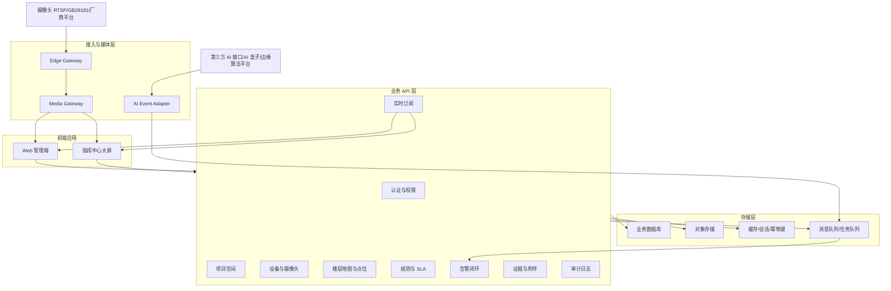
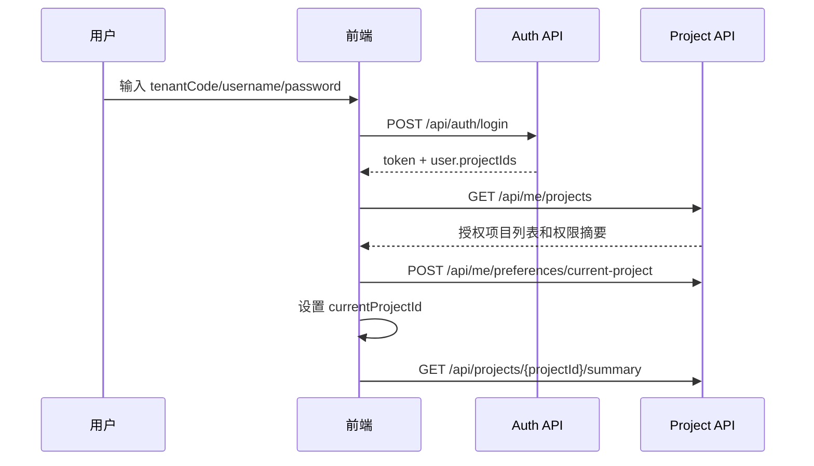
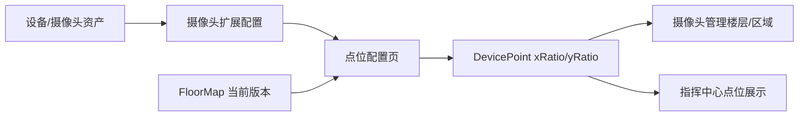
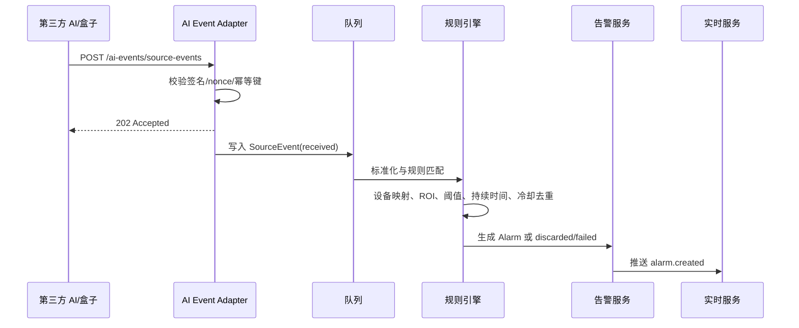
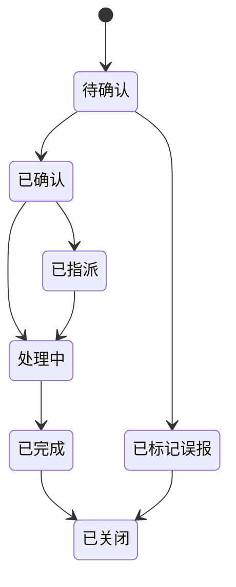
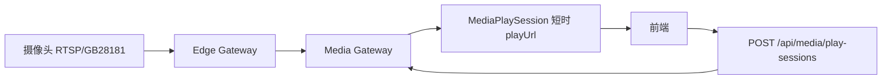

# 商业地产 AI 视频巡检 SaaS 技术架构说明书

版本：V1.0  
依据：`PRD.md` V1.0  
目标读者：后端、前端、测试、架构、实施交付人员

## 1. 文档目标

本文档将 PRD 转换为研发可执行的技术架构说明，重点说明：

- 系统整体模块拆分与职责边界。
- 推荐开发顺序与依赖关系。
- 核心业务链路的数据流转。
- 主要接口、数据模型与状态机落地方式。
- 单元测试、集成测试和端到端测试重点。

MVP 目标不是建设完整视频平台或自研 AI 平台，而是完成以下闭环：

```text
多项目权限上下文
  -> 摄像头/设备资产
  -> 楼层地图与点位配置
  -> 第三方 AI 事件接入
  -> 平台规则过滤与告警生成
  -> 指挥中心实时展示
  -> 告警确认、指派、处置、证据和审计
```

## 2. 总体架构

### 2.1 架构分层



### 2.2 模块边界原则

- 前端不接触摄像头原始流地址、摄像头账号密码、第三方 AI 密钥。
- 所有业务对象必须带 `tenantId`，项目级对象必须带 `projectId`。
- 业务接口必须校验 `tenantId + projectId + role + dataScope`。
- 告警、证据、附件、导出、审计等业务对象优先使用项目作用域路径。
- 第三方 AI 接入只负责标准化事件，告警是否生成由平台规则引擎决定。
- 点位坐标使用 `xRatio/yRatio` 相对坐标，不存绝对像素坐标作为主数据。
- 写操作优先支持 `Idempotency-Key`，避免重复点击或网络重试造成重复业务记录。

## 3. 推荐开发顺序

### 阶段 1：权限与项目上下文

目标：建立 SaaS 多租户、多项目访问底座。

开发内容：

- 登录、登出、令牌刷新、密码重置。
- 租户、用户、角色、权限点。
- 项目成员、项目角色、数据权限范围。
- `GET /api/me/projects` 与当前项目偏好。
- 基础审计写入能力。

核心验收：

- 用户只能看到授权项目。
- 切换项目后业务数据、实时订阅、视频会话、筛选缓存全部重置。
- 未授权项目不能访问告警、证据、视频和实时事件。

测试重点：

- 登录失败不暴露账号是否存在。
- 禁用用户后旧会话失效。
- 项目成员移除后无法继续访问项目 API。
- `dataScope=floor/zone/device` 能正确限制数据。

### 阶段 2：项目空间与设备资产

目标：建立项目、楼栋、楼层、区域、设备、摄像头、网关基础数据。

开发内容：

- 楼栋、楼层、区域查询和维护。
- 设备资产 CRUD。
- 摄像头扩展配置。
- 边缘网关配置。
- 摄像头列表与状态展示。

核心验收：

- 摄像头列表可按楼层、区域、状态、能力筛选。
- 摄像头源流凭据仅加密存储，不返回前端。
- 摄像头列表中的楼层/区域必须来自 `DevicePoint`，不是设备静态字段。

测试重点：

- `deviceHealthStatus`、`mediaStatus`、`pointConfigStatus`、`alarmState` 不混用。
- 禁用设备后规则和告警生成不再匹配该设备。
- 边缘网关离线时设备状态能正确更新。

### 阶段 3：地图上传与点位配置

目标：完成楼层图上传、转换、版本管理和设备点位配置。

开发内容：

- 楼层图上传：PNG/JPG/WebP/SVG；PDF 作为增强异步转换。
- SVG 安全清洗。
- `FloorMap.status`: `processing / active / failed / archived`。
- 点位拖拽、删除、保存、版本校验。
- 当前楼层地图与点位查询。

核心验收：

- 地图上传后可配置点位。
- 替换楼层图生成新 `floorMapVersion`，历史点位标记需校准。
- 多人编辑点位不会静默覆盖。
- 点位刷新后位置保持一致，大屏和摄像头列表同步读取。

测试重点：

- 超大文件、错误 MIME、恶意 SVG、PDF 转换失败。
- `floorMapVersion` 不一致时保存失败。
- `xRatio/yRatio` 超范围禁止保存。
- 同一设备同一项目默认只能存在一个点位。

### 阶段 4：媒体播放会话

目标：前端通过短时播放会话预览视频，不暴露原始流。

开发内容：

- `POST /api/media/play-sessions`
- `DELETE /api/media/play-sessions/{sessionId}`
- 会话过期、释放、失败原因。
- 项目切换、关闭弹窗、轮巡切换时释放会话。

核心验收：

- 前端只能拿到短时 `playUrl`。
- 会话过期或释放后旧地址不可继续访问。
- 大屏同时预览窗口不超过 10 路。

测试重点：

- 无权限用户不能创建播放会话。
- 项目 A 的会话不能播放项目 B 的摄像头。
- 网关离线、鉴权失败、断流、转码失败能返回明确 `failureReason`。

### 阶段 5：AI Event Adapter 与平台规则

目标：对接第三方 AI 事件，并通过平台规则决定告警生成。

开发内容：

- AI Event Adapter 配置、字段映射、设备编码映射、密钥轮换。
- 第三方事件推送鉴权：`X-App-Key`、`X-Timestamp`、`X-Nonce`、`X-Signature`。
- `SourceEvent` 标准化。
- 规则 CRUD、复制、删除、启停。
- `targetScope/targetIds/excludeDeviceIds` 规则绑定。
- SLA 策略配置。

核心验收：

- 合法第三方事件返回 `202 Accepted`。
- 重复事件不重复生成 `SourceEvent` 或告警。
- 低置信度事件 MVP 进入 `discarded`，不生成告警。
- 禁用规则后不再基于新事件生成告警。
- SLA 策略只影响新告警，历史告警保留快照。

测试重点：

- 签名错误、时间戳过期、nonce 重放。
- `sourceProvider + cameraCode/deviceCode` 映射失败。
- 同一事件重复推送。
- 规则按楼层/区域/摄像头/项目范围匹配。
- 冷却期内不重复生成有效告警。

### 阶段 6：告警生成与告警闭环

目标：完成告警状态机、内部指派、处置记录、证据和审计。

开发内容：

- 告警列表与详情。
- 告警状态动作：`confirm / markFalsePositive / assign / start / complete / close`。
- 内部指派处理人/部门。
- 处置备注、附件上传。
- 证据查看、下载令牌、软删除。
- 报表异步导出。
- 审计日志查询。

核心验收：

- 告警状态流转符合状态机。
- `待确认` 不可直接指派。
- `assign` 将 `已确认` 更新为 `已指派`。
- 误报必须填写原因。
- 证据查看、下载、删除、导出、附件上传都写审计。

测试重点：

- 越权状态流转被拒绝。
- 重复提交告警动作不生成重复记录。
- 证据短时地址过期后不可访问。
- 删除证据为软删除，保留审计摘要和哈希。
- 导出任务异步执行，下载地址短时有效。

### 阶段 7：指挥中心与实时订阅

目标：让大屏实时展示点位、告警、设备状态和视频轮巡。

开发内容：

- 项目切换器。
- 楼层切换与 2.5D 地图展示。
- 点位状态、告警闪烁。
- 实时订阅 token 与 SSE 流。
- 新告警、告警更新、设备状态、AI 接入状态、点位变更推送。

核心验收：

- 大屏显示当前项目数据，不串项目。
- 新告警 5-15 秒内展示。
- 实时订阅断线后可按 `lastEventId` 或短时间窗口补齐关键事件。
- 项目切换关闭旧 SSE/WebSocket 和视频会话。

测试重点：

- 项目切换后旧订阅不能继续收到事件。
- 同时发生告警状态变化和点位变化时页面状态一致。
- 长时间运行不明显卡顿。

## 4. 核心业务数据流

### 4.1 登录与多项目上下文



项目切换时必须执行：

```text
释放 MediaPlaySession
关闭 SSE/WebSocket
清空筛选条件和页面缓存
更新 currentProjectId
重新拉取项目 summary、楼层、点位、告警和订阅 token
```

### 4.2 设备接入与点位配置



关键约束：

- 设备资产不直接维护楼层/区域。
- 摄像头列表楼层/区域由 `DevicePoint + Floor + Zone` 反查生成。
- 点位保存必须携带 `floorMapVersion` 和点位 `version`。

### 4.3 第三方 AI 事件到告警



处理结果：

- 映射失败：`SourceEvent.status=failed`，`errorCode=device_mapping_not_found`。
- 低于阈值：`SourceEvent.status=discarded`，记录丢弃原因。
- 冷却期重复：不生成新有效告警，可记录过滤原因。
- 生成告警：`SourceEvent.status=alarmGenerated`。

### 4.4 告警处置闭环



动作约束：

| 当前状态 | 允许动作 | 结果状态 |
| --- | --- | --- |
| 待确认 | confirm | 已确认 |
| 待确认 | markFalsePositive | 已标记误报 |
| 已确认 | assign | 已指派 |
| 已确认 | start | 处理中 |
| 已指派 | assign | 已指派 |
| 已指派 | start | 处理中 |
| 处理中 | assign | 处理中 |
| 处理中 | complete | 已完成 |
| 已完成 | close | 已关闭 |
| 已标记误报 | close | 已关闭 |

所有动作写入 `AlarmAction`。证据访问、下载、删除、导出写入 `AuditLog`。

### 4.5 媒体播放链路



会话释放场景：

- 关闭预览弹窗。
- 切换项目。
- 大屏轮巡切换。
- 离开页面。
- 过期自动释放。

## 5. 模块职责清单

### 5.1 Auth/IAM 模块

职责：

- 登录、登出、刷新令牌、密码重置。
- 用户、角色、权限点、项目成员。
- 项目数据权限范围。

关键表：

- `User`
- `Role`
- `ProjectMember`
- `UserPreference`

单测重点：

- 用户状态变更影响鉴权。
- 项目成员角色变更后权限生效。
- 数据权限范围过滤正确。

### 5.2 Project/Space 模块

职责：

- 项目、楼栋、楼层、区域。
- 楼层地图上传、转换、版本。

关键表：

- `Project`
- `Building`
- `Floor`
- `Zone`
- `FloorMap`

单测重点：

- 楼层图版本递增。
- `processing/active/failed/archived` 状态转换。
- SVG 清洗与 PDF 转换失败处理。

### 5.3 Device/Camera 模块

职责：

- 设备资产、摄像头扩展、边缘网关。
- 健康状态、媒体状态、AI 能力标签。

关键表：

- `Device`
- `Camera`
- `EdgeGateway`
- `MediaStream`

单测重点：

- 设备状态与媒体状态独立计算。
- 摄像头凭据不出现在 API 响应。
- 禁用设备不参与规则匹配。

### 5.4 Map/DevicePoint 模块

职责：

- 点位查询、保存、删除。
- 相对坐标、旋转、层级、显隐。
- 乐观锁和楼层图版本校验。

关键表：

- `DevicePoint`
- `FloorMap`

单测重点：

- 同设备唯一点位约束。
- 坐标范围校验。
- 点位版本冲突。
- 楼层图版本变化后提示需校准。

### 5.5 AI Event Adapter 模块

职责：

- 第三方 AI 接入配置。
- 鉴权签名、nonce 防重放。
- 字段映射、设备编码映射。
- `SourceEvent` 标准化。

关键表：

- `AIEventAdapter`
- `SourceEvent`

单测重点：

- 签名覆盖 method/path/timestamp/nonce/bodyHash。
- 重复 `sourceEventId` 幂等。
- 映射失败记录 `failed`。
- 密钥轮换不回显旧密钥。

### 5.6 Rule/SLA 模块

职责：

- 平台规则 CRUD、复制、删除、启停。
- 目标范围匹配。
- ROI、阈值、持续时间、冷却时间、生效时间。
- SLA 策略配置与告警生成时快照。

关键表：

- `InspectionRule`
- `AlarmSlaPolicy`

单测重点：

- `targetScope` 匹配。
- `excludeDeviceIds` 生效。
- 冷却期去重。
- 禁用规则后不生成告警。
- SLA 只影响新告警。

### 5.7 Alarm 模块

职责：

- 告警生成、查询、详情。
- 状态机流转。
- 内部指派与处置记录。
- SLA 状态计算。

关键表：

- `Alarm`
- `AlarmAction`

单测重点：

- 状态机不允许越权跳转。
- 误报必须有原因。
- `Idempotency-Key` 防止重复动作。
- SLA 逾期计算。

### 5.8 Evidence/Attachment 模块

职责：

- 告警截图、短视频、处置附件。
- 查看短时地址、下载令牌、软删除。
- 水印、哈希、留存到期。

关键表：

- `Evidence`
- `Attachment`

单测重点：

- 文件类型和大小校验。
- 查看/下载权限。
- 下载令牌过期。
- 软删除保留哈希和审计摘要。

### 5.9 Realtime 模块

职责：

- 实时订阅 token。
- SSE/WebSocket 推送。
- 断线重连与事件补齐。

事件类型：

- `alarm.created`
- `alarm.updated`
- `device.statusChanged`
- `aiAdapter.statusChanged`
- `mapPoint.changed`

单测重点：

- token 与 `projectId` 绑定。
- 项目切换后旧订阅无效。
- `lastEventId` 补齐关键状态变化。

### 5.10 Audit 模块

职责：

- 关键操作审计。
- 项目级、租户级审计查询。
- 不允许业务页面删除审计日志。

审计字段：

- 操作者
- 动作
- 对象类型
- 对象 ID
- 结果
- IP/User-Agent
- 时间
- 失败原因

单测重点：

- 用户/角色/成员变更写审计。
- 证据查看、下载、删除、导出写审计。
- 规则变更、AI 接入密钥轮换写审计。

## 6. 单元测试与集成测试建议

### 6.1 单元测试优先级

P0：

- 权限校验与项目数据隔离。
- 第三方 AI 事件幂等。
- 告警状态机。
- 点位保存乐观锁。
- 规则匹配与冷却去重。
- 证据访问权限。

P1：

- 地图上传校验。
- 媒体播放会话过期释放。
- SLA 计算。
- 实时订阅 token 校验。
- 审计日志写入。

P2：

- 报表导出状态。
- 用户偏好项目保存。
- 规则复制与启停。

### 6.2 关键集成测试场景

1. 多项目隔离  
   用户拥有项目 A，不拥有项目 B，访问项目 B 的摄像头、告警、证据、实时订阅全部失败。

2. 点位同步  
   上传楼层图，配置点位，刷新页面，摄像头列表和大屏都展示新位置。

3. 第三方 AI 事件告警生成  
   推送合法事件，平台生成 `SourceEvent`，匹配规则后生成告警，大屏收到 `alarm.created`。

4. 冷却去重  
   同一摄像头、同一规则、同一 ROI 在冷却期内重复推送，不生成重复告警。

5. 告警处置  
   待确认 -> 已确认 -> 已指派 -> 处理中 -> 已完成 -> 已关闭，全链路产生 `AlarmAction` 和审计。

6. 误报闭环  
   待确认 -> 已标记误报，必须填写误报原因，可关闭。

7. 媒体会话释放  
   创建播放会话，切换项目或关闭页面，释放会话，旧地址失效。

8. 实时重连  
   SSE 断开后带 `lastEventId` 重连，补齐期间发生的告警状态变化。

9. 附件与证据  
   上传处置附件，查看证据，下载证据，删除证据，全部写审计。

10. 导出报表  
   按筛选条件创建导出任务，完成后获取短时下载地址，写入审计。

## 7. 前端落地建议

### 7.1 全局状态

前端至少维护：

- `authToken`
- `currentTenant`
- `currentProjectId`
- `projectPermissions`
- `dataScope`
- `realtimeSubscription`
- `activeMediaPlaySessions`

项目切换必须统一走一个动作，不能由页面各自处理：

```text
releaseMediaSessions()
closeRealtimeSubscription()
clearPageFilters()
clearProjectScopedCache()
setCurrentProject(projectId)
reloadProjectBootstrapData()
```

### 7.2 页面路由建议

```text
/login
/dashboard
/cameras
/map-config
/alarms
/rules
/settings/users
/settings/project-space
/settings/devices
/settings/ai-adapters
/settings/sla
/settings/audit-logs
```

### 7.3 前端测试重点

- 无权限按钮不展示，接口仍要后端拦截。
- 项目切换时页面不会显示旧项目数据。
- 点位拖拽保存失败后保留草稿。
- 视频预览关闭后释放会话。
- 告警状态按钮按当前状态动态显示。
- SSE 断开后有重连和状态恢复。

## 8. 后端落地建议

### 8.1 服务组织

MVP 可以采用模块化单体或轻量服务化。推荐先用模块化单体降低协作成本，但保留清晰领域边界：

```text
auth
project
device
map
media
ai-adapter
rule
alarm
evidence
realtime
audit
export
```

### 8.2 事务边界

建议事务内完成：

- `SourceEvent` 幂等写入。
- 告警生成与 `AlarmAction` 首条记录。
- 告警状态流转与 `AlarmAction`。
- 点位保存与版本更新。
- 证据软删除与审计摘要。

建议异步完成：

- PDF 转换。
- 第三方事件规则处理。
- 告警报表导出。
- 证据水印与视频片段处理。
- 实时消息广播。

### 8.3 幂等策略

| 场景 | 幂等依据 |
| --- | --- |
| 第三方 AI 事件 | `tenantId + projectId + sourceProvider + sourceEventId` |
| 告警动作 | `Idempotency-Key + alarmId + action` |
| 附件上传 | `Idempotency-Key + alarmId` |
| 下载令牌 | `Idempotency-Key + evidenceId` |
| 导出任务 | `Idempotency-Key + userId + filterHash` |

## 9. 交付检查清单

研发提测前，至少确认：

- 多项目权限隔离已覆盖单元测试和接口测试。
- 摄像头源流地址不出现在任何前端响应。
- 地图上传、点位配置、大屏展示链路完成。
- 第三方 AI 事件能异步生成告警。
- 告警状态机与内部指派闭环完成。
- 证据查看、下载、删除、导出全部写审计。
- SSE/实时订阅在项目切换时清理。
- 媒体播放会话在关闭和过期时释放。
- 关键列表接口支持分页、排序、关键词。
- 导出任务异步执行并返回短时下载地址。

